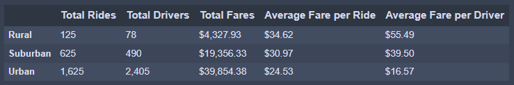
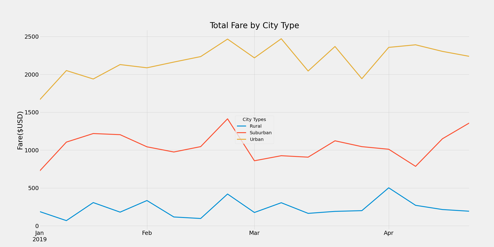

# Pyber_Analysis

## Resources
* Data sources: 
    * [city_data.csv](Resources/city_data.csv)
    * [ride_data.csv](Resources/ride_data.csv)
    * [PyBer_ride_data.csv](Resources/PyBer_ride_data.csv)

* Software: 
    * Anaconda 4.11.0
    * Jupyter Notebook 6.4.5 
    * Python 3.9.7
    * Visual Studio Code 1.63.2

## Overview/Purpose
This project/challenge tasked me with analyzing ride share data from the first few months of 2019 and making visuals to show the summaries of each city type the business operated it: Urban, Suburban, and Rural. The summaries needed to include... 
*   Total Rides
*   Total Drivers
*   Total Fares
*   Average Fare per Ride
*   Average Fare per Driver
I then needed to create a line graph that represented a comparison of total fares made by each city (seen below in results)

## Results
### Collecting and Calculating The Info

After making and merging the city_data and ride_data DataFrames from the resources provided, I was able to make a summary DataFrame of the needed info (Total Rides, Average Fare per Ride, etc.) using the `.groupby()` function while calculating totals and averages. Putting all that info into its own DataFrame with a little formatting resulted in this table

#### PyBer Summary DataFrame

With this sorted data, I was able to use `.groupby()` again on the new `pyber_summary_df` to make a separate DataFrame (`pyber_sum_fares_df`) to find and sum the total fares earned by each city type. However, to use this data for my line graph I needed to do three things:
*   Create a pivot table using the `.pivot()` function to get the total fares from each city type by the date
*   Convert the provided dates using the `.to_datetime()` function so that I could...
*   Use the `.resample()` function to place the total fares earned into weekly bins

After making these changes to the `pyber_sum_fares_df` I was able to generate a line graph to show the data as to visualize the differences in eared fares between the three city types in the graph below.

#### Total Fares by City Type

*   Please note that I was required to place the legend in the center of the graph and add no x_axis label per the challenge instructions

## Summary

As we can see from both the PyBer Summary DataFrame and Total Fares line graph, there is a significant difference in the earned fares from each city type. Some important things to emphasize:
*   Despite having the lowest totals and averages, rural rides are significantly more profitable.
*   Rural and suburban cities have the total number of rides greater than the total number of drivers

### Recommendations
Clearly their is a large market of customers that are looking for ride sharing services, regardless of city type. However, the finding of this analysis bring to light some ideas for how to improve business going forward.

#### 1. Deploy more rural and suburban drivers
No doubt the high average fare in rural areas comes from the fact that there are so few drivers. Lack of available drivers means that fare prices inflate. Since rides outnumber drivers in rural and suburban areas, it would be a great idea to deploy more drivers in these cities. More drivers would be mean lower fares and in turn more/cheaper rides for our customers. This could even allow for PyBer to be considered the ride sharing platform that is "Available Anywhere and Everywhere".

#### 2. Urban cities have a saturation of drivers
The problem in rural areas is the high prices, which could be solved with more drives. The opposite can be said about urban cities. The majority of our fares come from urban cities, but there are far more drivers than rides in these areas. It might be beneficial going forward if we allocate resources to **marketing** urban customers rather than adding any more drivers. That way the drives that are present can increase their total number of rides.

#### 3. More data should be collected for greater insight
While these findings are very good at showing us how to proceed with business practices, a few more data points could go a long way. The biggest of which would be "ride time" and/or "ride distance" if possible. This data might help explain why the trends we found here exist. Like why rural fares are so much higher, is it because those rides tend to be longer/farther? Data like this could greatly help aim PyBer in the right direction in the future.